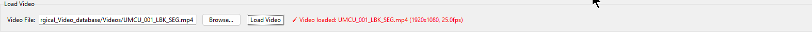
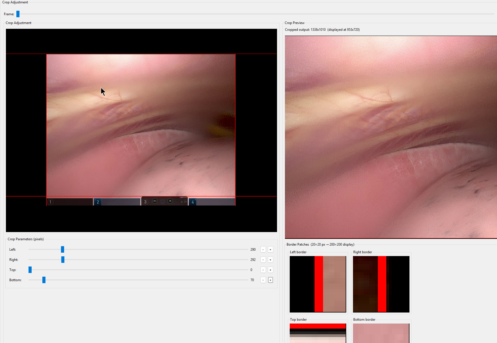
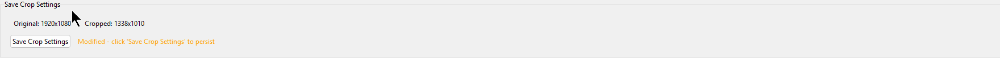
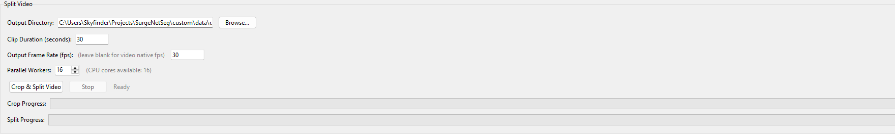
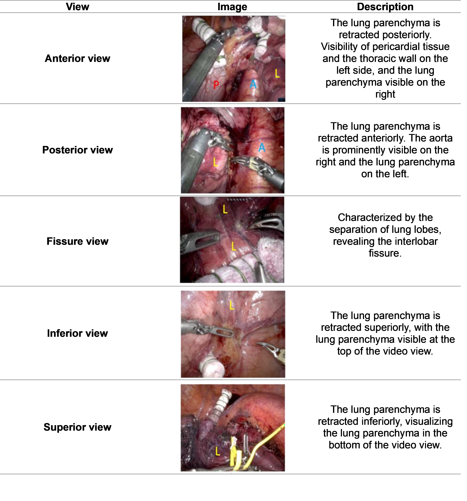
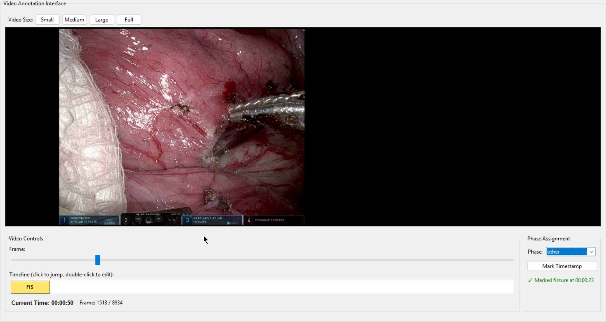

[[@toc]]

# Data Annotation Pipeline

This Readme outlines the process of data annotation with the SurgeNetSeg / ATLAS interactive Repository


## Data preprocessing

We start with a new Video source. This can be a .mkv or mp4 file. 

We use the dedicated `video_crop_and_split_app` to prepare the data. 
Use this command to create load the video.


```
python custom\video_crop_and_split_app.py
```

### 1. Load a Video


The videos for surgical Video segmentation are on the One-Drive under `OneDrive - surgicalreality.com/Team - Documents/Segmentation/Database/Surgical Video/Surgical_Video_database/Videos/`

### 2. Adjust the Crop



Select a frame that is representative via the slider at the top. 
Then adjust the crop by adjusting the red margin-lines via the sliders below. 
The preview and the zoomed preview at the borders help to make sure they are aligned well.
For our experiments we removed the full da Vinci overlay at the bottom, since it could introduce bias into the data when it is showing specific selections of tools. 

### 3. Save Crop
Make sure to save the crop settings for the video. 

This edits the corresponding part in the `custom/crop_config.json` file, which saves the crops for further processing and adjustment. 
It saves the video filename as a prefix for all further processing of the clips:

<details>

<summary> file structure of crop_config.json</summary>

```
{
    "videos": {
        "s8-s10_LLL": {
            "crop_params": {
                "left": 367,
                "right": 339,
                "top": 0,
                "bottom": 76
            },
            "original_resolution": {
                "width": 1920,
                "height": 1080
            },
            "new_resolution": {
                "width": 1214,
                "height": 1004
            },
            "video_prefix": "s8-s10_LLL"
        },
        ....
```

</details>

### 4. Apply crop and split the videos 


Using multithreading, this functionality splits the video and applies the crop, saving every sub-clip in the specified directory. 
I used a `custom/data/` directory that was not tracked in git for this. You may need to create this directory. 
In this example i use the path of `custom/data/output_clips/` to select all clips from for further processing. 

They are saved like this: `custom\data\output_clips\UMC_Test_Clip_0000_0030_sec.mp4`, containing the start and end second of the split for orientation.

## View Annotation

For the distribution analysis we need a surgical View annotation of the Video. 
This is done after the figure of Quintens paper: 

To the views described in this figure, we added `normal` and `other` views. `normal` means the lung is infront of the camera but undeformed. (This happens especially in the start of the surgery and in transitions between views). `other` is everything else that cannot be specified by the views e.g. when the camera is taken out and cleaned, when the flurecence overlay is used and when the view cannot be classified. This does not need to be done for the whole clip, but shuould cover the clips of interest that we annotate later. 

To perform the view annotation, use the app `video_annotation_app.py`

```
python custom/video_annotation_app.py
```

### 1. Load the original Video
Select the original video again and load it into the application

### 2. Annotate the video



Scroll through the video and mark timestamps. The timestamp always marks the clip up to the current mark and labels the section with the designated phase. 
Views can be annotated via double click, but not that deleting causes problems, this has not been fixed! Consider starting over (via the load Video Button) or just relabeling views instead. 

### 3. Save annoation
Save the annotation to JSON. This saves the view annotations to `custom/view_annotation.json` like so:

<details>

<summary>File structure of view_annotation.json</summary>

```
{
    "videos": {
        "RLL_S9": {
            "phases": {
                "phase_1": {
                    "view": "other",
                    "start_time": "00:00:00",
                    "end_time": "00:00:50"
                },
                "phase_2": {
                    "view": "anterior",
                    "start_time": "00:00:50",
                    "end_time": "00:00:59"
                },
                ...
```
Again this saves the original file name as a prefix so it can be matched later. 

</details>

## Pick a clip
Look at the view annotations and select a clip you want to start with for the annotation. 
If the dataset is bigger and you want to balance the view representation, perform a dataset analysis first. 

We have 2 scripts for this: 

1. To analyse the workspace use: `python custom\analyze_mask_labels.py`

This script need the following arguments: 
(optional) `--mask_dir` default: `./workspace` Directory containing mask .png files.
(optional) `--annotation` default: `./custom/view_annotation.json` Path to view_annotation.json for phase/view analysis (optional).
(optional)`--save` default=None Path to save the plots

Full example
```
python custom\analyze_mask_labels.py

```


2. For a exported dataset made with `convert_to_DAVIS_dataset`use: `python custom\analyze_mask_labels_dataset.py`

It needs the following arguments: 
`--mask_dir [dir]` e.g. `custom\data\DAVIS_1.2.1\Annotations` Directory containing mask .png files."
`--annotation [annotation.json]` (optional) because default is: `./custom/view_annotation.json`
`--save [dir]` Path to save the plots (optional, will be suffixed with _train/_val/_test)
    
`--train_list [.txt]` e.g. `custom\data\DAVIS_1.2.1\training_list.txt` Path to text file listing clips for training split (one clip name per line).
`--val_list [.txt]` e.g. `custom\data\DAVIS_1.2.1\val_list.txt` Path to text file listing clips for training split (one clip name per line).
`--test_list [.txt]` e.g. `custom\data\DAVIS_1.2.1\test_list.txt` Path to text file listing clips for training split (one clip name per line).

Full example:
```
python custom\analyze_mask_labels.py --mask_dir .\custom\data\DAVIS_1.2.1\Annotations --train_list .\custom\data\DAVIS_1.2.1\training_list.txt --val_list .\custom\data\DAVIS_1.2.1\val_list.txt --test_list .\custom\data\DAVIS_1.2.1\test_list.txt
```


Pick a clip based on the view annotation or scrubbing through the original video clip and selecting the timestamp where the areas of interest appear. 

## Segment Annotation

To perform the segmentation annotation we use the ATLAS interactive / SurgeNetSeg (,this) repository. 

To annotate a video you pick use the gui.py app.

An example to start is this command:
```
python gui.py --video "C:\Users\Skyfinder\Projects\SurgeNetSeg\custom\data\output_clips\UMC_Test_Clip_0030_0060_sec.mp4" --num_objects 17
```
--num_objects has to be set and corresponds to the number of labels available for annotation. In our example we had 17 labels, though in the final dataset we only used 11 (excluded fissures, lymph nodes and phrenic nerve)


Annotate the video as described in the Annotation markdown files section "Examples for segmentation"


## Dataset export
This script exports all videos in the workspace
This can be done 1:1 like so:
```
python custom/convert_to_DAVIS_dataset.py --workspace_path ./workspace --out_path custom/data/DAVIS_1.3 --threads 16
```

Or with sub-snippeds
```
python custom/convert_to_DAVIS_dataset.py --workspace_path ./workspace --out_path custom/data/DAVIS_1.2.1 --threads 16 --snippet_length 60
```
The script also creates the dataset split in the form of .txt files which contain the list of the video clips for train, val and test. 
(optional argument --split_config default="./custom/train_test_val_split.json")

Default path for dataset: `/media/scratch/Robin/sam2_training_data`

## Check segmentations (in the workspace) for completeness
This script simply compares the images vs the annoation folders in the workspace and wather every image has a corresponding mask saved. 
```
python custom/annotation_check.py
```


## Stitch video together

If we want the full clip for demo purposes, I created a script that combines the masks with the frames again to create a video:
```
python custom/stitch_video.py "s8-s10_LLL_0660_0690_sec_cropped.mp4" --alpha 0.35 --fps 30 --workers 16
```